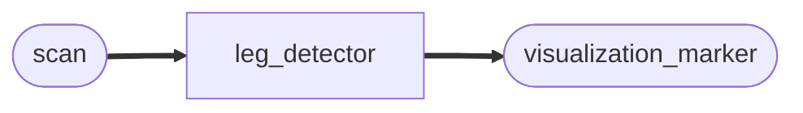

# leg_detector

## 概要
LiDARを用いて人の足を検出するプログラム

### Node and Topic



#### 対象とするスキャン角度を指定（初期値：-45°〜45°）
scan_angle_min_ = -M_PI / 4; <br>
scan_angle_max_ = M_PI / 4;

#### 対象となる距離の上限 [m]
distance_threshold_ = 1.0;（初期値1.0m）

上記の範囲内に足を検出した場合は、`足検出`メッセージを表示する

## 実行方法
```
$ ros2 run leg_detector leg_detector_node
```
